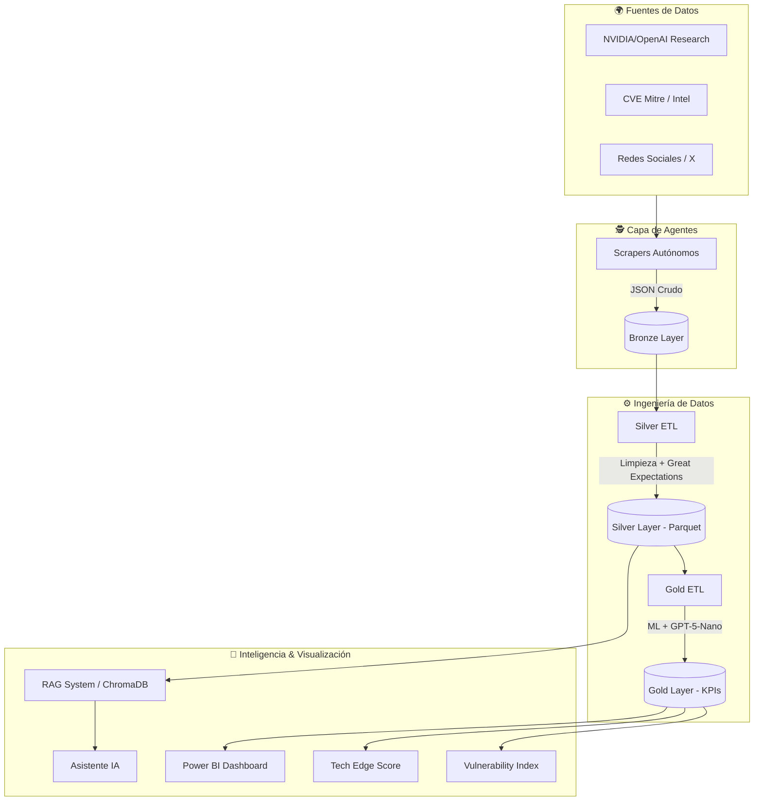

# 🛡️ CiberMonitoring: Plataforma de Ciberinteligencia y Monitoreo del Borde Tecnológico

> **Diplomado IA y TA | Módulo 4: Proyecto Integrador**
>
> *Fusión de Big Data y Ciberseguridad para la defensa proactiva.*

---

## 📖 Resumen Ejecutivo

**CiberMonitoring** es un sistema avanzado de **Inteligencia Predictiva** que correlaciona el surgimiento de tecnologías emergentes con nuevas vulnerabilidades de seguridad.

Mediante una red de **Agentes de Web Scraping** autónomos, el sistema monitorea masivamente fuentes críticas (NVIDIA, OpenAI, MITRE, Dark Web proxies). La información es procesada por un pipeline de **Big Data** enriquecido con **Inteligencia Artificial (GPT-5)** para generar alertas tempranas visuales, permitiendo a las organizaciones anticiparse a amenazas en infraestructura de vanguardia.

---

## 🏗️ Arquitectura del Sistema

El proyecto sigue una arquitectura **Medallion (Bronze/Silver/Gold)** potenciada por un cerebro **RAG (Retrieval-Augmented Generation)**.

---

## 🚀 Componentes Desarrollados

### 1. 🕵️ Agentes de Recolección (Data Collection)
Flota de robots autónomos diseñados con **Playwright** y **AsyncIO** para la navegación profunda.
*   **Fuentes de Investigación**: Monitoreo de *Papers* en NVIDIA y OpenAI para detectar hacia dónde se mueve el "Borde Tecnológico".
*   **Fuentes de Amenazas**: Rastreo en tiempo real de CVEs en MITRE e Intel.
*   **Señales Sociales**: Análisis de tendencias en Twitter/X.

### 2. ⚙️ Pipeline de Datos (ETL)
Transformación robusta de datos para Machine Learning.
*   **Capa Bronze**: Data Lake de archivos crudos.
*   **Capa Silver**: Datos limpios, deduplicados y validados con **Great Expectations**.
*   **Capa Gold**:
    *   **🧪 Tech Edge Score**: Algoritmo que utiliza **GPT-5-Nano** para leer títulos de papers y calificar su nivel de innovación (0-10).
    *   **📉 Vulnerability Index**: Agregaciones de series de tiempo para predicción de riesgos.
    *   **🔗 Matriz de Correlación**: Análisis cruzado entre sentimiento social y severidad de vulnerabilidades.

### 3. 🧠 Sistema RAG (Cerebro Vectorial)
Base de conocimientos inteligente construida con **LangChain** y **ChromaDB**.
*   Permite "conversar" con la base de datos completa.
*   Ingesta automática desde la Capa Silver.
*   Búsqueda semántica usando embeddings locales (`all-MiniLM-L6-v2`) para eficiencia y privacidad.

---

## 🛠️ Stack Tecnológico

| Área | Tecnologías |
| :--- | :--- |
| **Lenguaje Core** | Python 3.11+ |
| **Data Engineering** | Pandas, PyArrow (Parquet), Great Expectations |
| **IA & LLMs** | OpenAI (GPT-5-Nano), LangChain, ChromaDB, Scikit-Learn |
| **Web Scraping** | Playwright, BeautifulSoup, HTTPX |
| **Infraestructura** | Docker (Ready), PowerShell |

---

## 🔮 Próximos Pasos Visuales
Los datos procesados en la capa **Gold** están listos para ser conectados a **Power BI**, donde se visualizarán:
1.  Evolución temporal de riesgos vs. lanzamientos tecnológicos.
2.  Mapa de calor de "Tech Edge" (Qué empresas están innovando más rápido).
3.  Alertas de correlación (Picos de discusión en redes -> Aparición de CVEs).

---
*Proyecto desarrollado para el Diplomado de Inteligencia Artificial y Tecnologías Avanzadas.*
