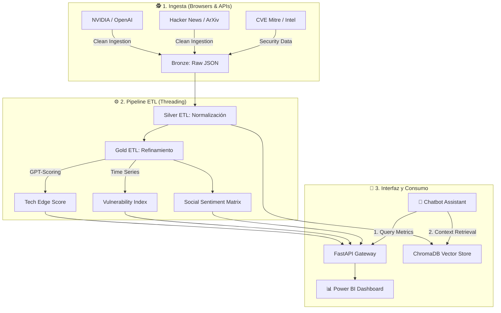

# 🛡️ CiberMonitoring: Plataforma de Ciberinteligencia y Monitoreo del Borde Tecnológico


> **Diplomado IA y TA | Módulo 4: Proyecto Integrador**
>
> *Sistema autónomo de inteligencia predictiva que correlaciona innovación tecnológica con riesgos de ciberseguridad.*

---

## 📑 Resumen Ejecutivo

**CiberMonitoring** es una plataforma integral de inteligencia de amenazas diseñada para monitorear el "borde tecnológico" (Edge-tech). El sistema automatiza la recolección de datos de fuentes de alta fidelidad como NVIDIA Research, OpenAI y ArXiv, cruzándolos con avisos de vulnerabilidad (CVE) y señales sociales (Hacker News, Twitter). 

A través de un pipeline de datos robusto cargado en **Docker**, el proyecto transforma datos crudos en KPIs accionables (Innovation Score, Risk Index) y ofrece una interfaz conversacional inteligente que permite a analistas consultar el estado del ecosistema mediante lenguaje natural.

---

## 🚀 Actualizaciones y Hitos Recientes

### 🧠 Multi-Model AI Storytelling (Resiliencia Extrema)
Se ha implementado una arquitectura de **relevo automático de modelos**. El generador de narrativas intenta procesar insights con **Gemini 3 Flash**, con fallback automático a **GPT-5 Nano** y **Claude Haiku** en caso de latencia o errores, garantizando disponibilidad 24/7.

### ⚡ Optimización Masiva de ETL
El pipeline Gold ha sido optimizado mediante **paralelismo (Threading)**. El procesamiento de cientos de registros con IA pasó de ~15 minutos a menos de 2 minutos, aprovechando al máximo la capacidad de cómputo del sistema y mejorando el manejo de errores de parsing.

### 🔄 Evolución de Fuentes Sociales
Sustitución estratégica de Reddit por **Hacker News API** para garantizar estabilidad en el despliegue Docker, eliminando dependencias pesadas de navegadores (Selenium) y mejorando la calidad de las señales técnicas recolectadas.

### 🔐 Seguridad y Centralización
Migración de secretos a una gestión centralizada mediante `.env` fuera del repositorio y configuración profesional de `.gitignore` para proteger credenciales.

---

## 🏗️ Arquitectura del Sistema



---

## 🏗️ Despliegue con Docker

El proyecto está contenerizado para un despliegue rápido.

### 1. Configuración
Crea un archivo `.env` en la raíz con tus llaves correspondientes.

### 2. Ejecutar Pipeline de Ingesta (Batch)
```bash
docker-compose --profile ingest up
```
*Esto ejecutará secuencialmente: Scrapers -> Limpieza -> Análisis IA -> Indexación Vectorial.*

### 3. Iniciar Chatbot e Interfaz (Gradio)
```bash
docker-compose up chatbot
```

---

## 🧩 Módulos del Proyecto

| Módulo | Función | Tecnología |
| :--- | :--- | :--- |
| **`agents/scrapers`** | Recolección autónoma de datos. | Python, Playwright, Requests |
| **`data_engineering`** | Pipeline de limpieza y métricas Gold. | Pandas, Threading, OpenAI API |
| **`api_gateway`** | Backend que sirve KPIs en tiempo real. | FastAPI, JSON |
| **`rag_system`** | Inteligencia semántica y vectores. | LangChain, ChromaDB |

---

## 🏛️ Créditos Académicos
Este proyecto fue desarrollado íntegramente para el **Diplomado en Inteligencia Artificial y Tecnologías Avanzadas** de la **Facultad de Ingeniería / Ciencias de la Computación** de la **Universidad Autónoma de San Luis Potosí (UASLP)**.

*Desarrollado para la Excelencia en Ciberinteligencia.*
