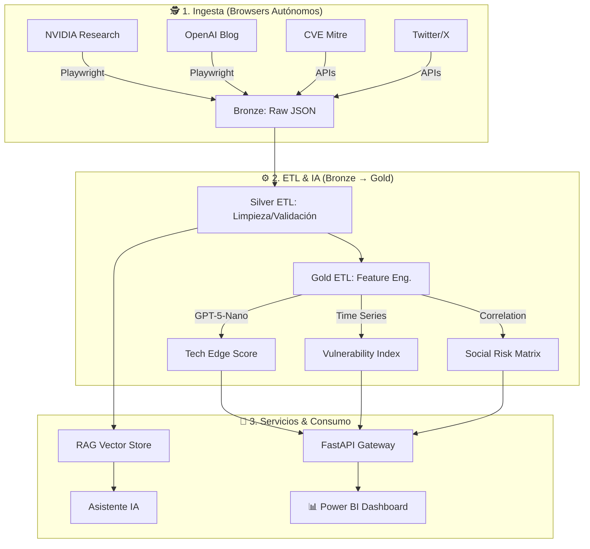

# 🛡️ CiberMonitoring: Plataforma de Ciberinteligencia y Monitoreo del Borde Tecnológico


> **Diplomado IA y TA | Módulo 4: Proyecto Integrador**
>
> *Sistema autónomo de inteligencia predictiva que correlaciona innovación tecnológica con riesgos de ciberseguridad.*

---

## 📖 Visión General
**CiberMonitoring** fusiona Big Data, Web Scraping y Modelos de Lenguaje (LLMs) para crear un **Dashboard de Defensa Proactiva**. El sistema monitorea continuamente el "estado del arte" en IA (Papers de NVIDIA/OpenAI) y lo cruza con vulnerabilidades emergentes (CVEs), permitiendo a los analistas visualizar el riesgo de adoptar nuevas tecnologías antes de que sea crítico.

---

## Actualizaciones Recientes

### 2026-01-19 - Multi-Modelo y Web Scraping 2.0

#### 🧠 Multi-Model AI Storytelling
Un nuevo generador de narrativas ha sido integrado en el Dashboard, impulsado por una arquitectura de **relevo de modelos** para máxima resiliencia:
- **Flujo de Trabajo**: Intenta generar insights con **Gemini 3 Flash**, si falla recurre a **OpenAI GPT-5**, y finalmente a **Claude Haiku**.
- **Trazabilidad**: Cada insight generado guarda el registro de qué modelo lo creó, visible en el Dashboard.
- **API History**: Endpoint `/api/v1/storytelling-history` expone toda la memoria histórica de insights generados.

#### 🕷️ Reddit API Integration (Standby)
Se ha migrado la recolección de datos de Reddit de Selenium a la **API oficial (PRAW)**:
- **Estado**: **Standby** (En espera de aprobación de credenciales por parte de Reddit).
- **Cumplimiento**: El scraper está preparado para operar bajo el framework oficial v3 de Reddit, garantizando estabilidad y respeto a los límites de tráfico.
- **Fuentes**: `r/cybersecurity`, `r/hardware`, `r/intel`, `r/amd`, `r/nvidia`.
- **Datos**: Extrae títulos, contenido y metadatos de posts mediante el cliente oficial.

#### Nuevos Scrapers Implementados (Legacy)
**arXiv Scraper**
- Descripción: Recolecta papers académicos de categorías de Ciencias de la Computación (AI, Criptografía).
- Fuente de datos: arXiv API
- Datos capturados: Título, abstract, autores, URL PDF, fecha de publicación, fecha de recolección.

#### Mejoras en Sistema de Fechas
- Todos los scrapers normalizan a UTC ISO 8601.
- Pipeline Silver unifica fuentes heterogéneas (Tweets, Posts, Papers).

---

## 🏗️ Arquitectura del Sistema



---

## 🚀 Despliegue con Docker

El proyecto está contenerizado para un despliegue rápido y consistente.

### 1. Configuración
Asegúrate de tener un archivo `.env` en la raíz (puedes copiar el de `agents/scrapers/.env`):
```env
OPENAI_API_KEY=sk-...
TWITTER_BEARER_TOKEN=...
```

### 2. Iniciar Servicios (API)
Para levantar la API Gateway (Backend del Dashboard):
```bash
docker-compose up -d api
```
*   **API URL**: `http://localhost:8000`
*   **Documentación**: `http://localhost:8000/docs`

### 3. Ejecutar Pipeline de Ingesta (Batch)
Para disparar los scrapers y actualizar todas las bases de datos (ETL + Vector Store):
```bash
docker-compose --profile ingest up
```
*Esto ejecutará secuencialmente: Scrapers -> Limpieza -> Análisis GPT-5 -> Indexación Vectorial.*

---

## 🧩 Módulos del Proyecto

| Módulo | Descripción | Tecnologías |
| :--- | :--- | :--- |
| **`agents/scrapers`** | Flota de robots que navegan webs dinámicas y APIs. | Playwright, AsyncIO |
| **`data_engineering`** | Pipelines Bronze/Silver/Gold con validación de calidad. | Pandas, Great Expectations |
| **`api_gateway`** | API REST que sirve los KPIs calculados a Power BI. | FastAPI, Uvicorn |
| **`rag_system`** | Base de conocimiento vectorial para búsquedas semánticas. | LangChain, ChromaDB |

---

## 📊 Integración con Power BI

Para conectar Power BI a la plataforma:
1.  Abrir Power BI Desktop.
2.  Seleccionar **Inportar datos desde Web**.
3.  Usar los endpoints de la API:
    *   **Innovation Score**: `http://localhost:8000/api/v1/tech-edge-score`
    *   **Risk Index**: `http://localhost:8000/api/v1/vulnerability-index`
    *   **Correlations**: `http://localhost:8000/api/v1/correlation/matrix`

---

## 🤖 Asistente Conversacional (Gemma 3)

El proyecto incluye una interfaz de chat avanzada potenciada por **Gemma 3 (4B)** y Gradio.

### Capacidades
*   **RAG (Retrieval Augmented Generation)**: Consulta la base de conocimiento local (ChromaDB).
*   **Uso de Herramientas (Tool Use)**: El agente puede consultar dinámicamente la API para obtener métricas en tiempo real (Tech Edge Score, Risk Index).
*   **Interfaz Personalizada**: Diseño CSS adaptado para modo Dark/Light profesional.

### Ejecución
```bash
cd gradio_assistant
python app.py
```
Acceso: `http://localhost:7860`

---
*Desarrollado para la Excelencia en Ciberinteligencia.*
