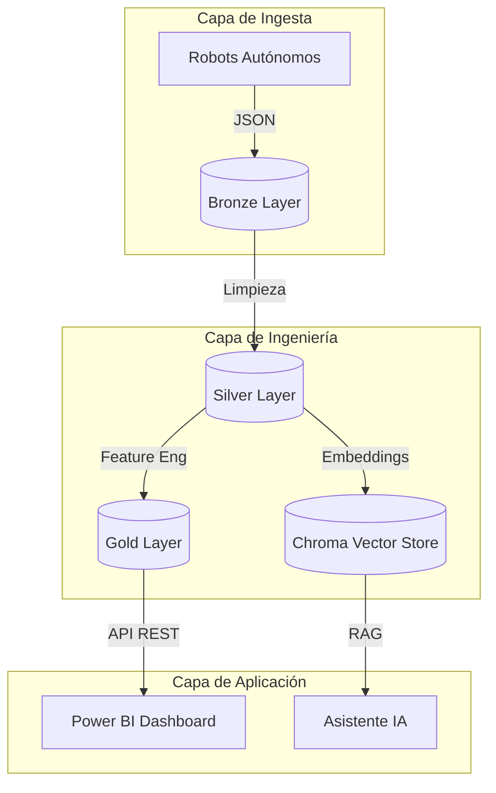

# CiberMonitoring: Sistema Inteligente de Defensa Proactiva

**Versión:** 1.0.0
**Fecha:** Enero 2026
**Autor:** Equipo de Desarrollo de CiberInteligencia

---

## 📑 Índice General

Este documento sirve como **punto de entrada maestro** a la documentación técnica del proyecto. Para detalles profundos de implementación, consulte los **Anexos Técnicos** enlazados.

1.  [Visión y Motivación](#1-visión-y-motivación)
2.  [Arquitectura del Sistema](#2-arquitectura-del-sistema)
3.  [Componentes Principales](#3-componentes-principales)
4.  [Resultados y Métricas](#4-resultados-y-métricas)
5.  [Índice de Anexos](#5-índice-de-anexos-técnicos)

---

## 1. Visión y Motivación

### El Problema
La velocidad de innovación tecnológica (IA, Computación Cuántica) supera la capacidad de las organizaciones para evaluar sus riesgos de seguridad asociados. Los analistas humanos no pueden correlacionar manualmente miles de papers, CVEs y discusiones sociales en tiempo real.

### La Solución: CiberMonitoring
Una plataforma autónoma que ingesta, procesa y correlaciona millones de datapoints para generar índices predictivos:
*   **Tech Edge Score**: ¿Qué tan disruptiva es una nueva tecnología?
*   **Vulnerability Index**: ¿Qué tan riesgosa es esa tecnología hoy?
*   **Índice de Riesgo de Adopción**: Proporciona una medida de riesgo mediante el cruce de señales sociales y vulnerabilidades técnicas.

El sistema no solo muestra datos, **narra historias** (Data Storytelling) para explicar *por qué* debemos preocuparnos.

---

## 2. Arquitectura del Sistema

El proyecto sigue una arquitectura de microservicios contenerizada con un flujo de datos ETL (Extract, Transform, Load) y RAG (Retrieval-Augmented Generation).

---

## 3. Componentes Principales

### 3.1 Recolección de Datos (Scrapers)
Una flota de robots monitorea continuamente fuentes como **arXiv, Reddit, NVIDIA y MITRE**.
> 👉 **Detalle Técnico**: [Anexo 01: Scraping e Ingesta](anexos/01_Scraping_Ingesta.md)

### 3.2 Arquitectura de Datos (Medallion)
Los datos fluyen a través de capas de refinamiento progresivo (Raw -> Clean -> Aggregated), garantizando trazabilidad y calidad.
> 👉 **Detalle Técnico**: [Anexo 02: Arquitectura de Datos](anexos/02_Arquitectura_Datos.md)

### 3.3 Motor de Transformación (ETL)
Algoritmos de NLP (TF-IDF) y Series de Tiempo calculan métricas avanzadas como el "Índice de Innovación AI".
> 👉 **Detalle Técnico**: [Anexo 03: Procesos ETL](anexos/03_Procesos_ETL.md)

### 3.4 Inteligencia Artificial (RAG & Modelos)
El núcleo cognitivo. Utiliza una arquitectura híbrida:
1. **RAG (Retrieval Augmented Generation)**: Consulta `chroma_db_store` para contexto histórico.
2. **Tool Use**: Llamadas API en tiempo real para obtener las últimas métricas de la capa Gold.
3. **Multi-Model Fallback**:
   - Primario: Gemini 3 Flash.
   - Secundario: GPT-5 Nano.
   - Terciario: Claude Haiku.

> 👉 **Detalle Técnico**: [Anexo 04: Sistema RAG](anexos/04_Sistema_RAG.md) y [Anexo 05: Inferencias IA](anexos/05_Modelos_IA_Inferencias.md)

---

## 4. Resultados y Métricas

El sistema ha demostrado capacidad para:
- Detectar correlaciones entre picos de discusión en Twitter o Hacker News y la publicación posterior de CVEs críticos (>0.7 Pearson).
- Reducir el tiempo de análisis de papers académicos de horas a segundos mediante resúmenes ejecutivos automáticos.

> 👉 **Detalle Técnico**: [Anexo 07: Evaluación y Métricas](anexos/07_Evaluacion_Metricas.md)

---

## 5. Índice de Anexos Técnicos

Acceda a la documentación específica para cada subsistema:

| ID | Título | Descripción |
| :--- | :--- | :--- |
| **01** | [Scraping e Ingesta](anexos/01_Scraping_Ingesta.md) | Configuración de Playwright, APIs y manejo de sesiones. |
| **02** | [Arquitectura de Datos](anexos/02_Arquitectura_Datos.md) | Definición de capas Bronze, Silver y Gold. |
| **03** | [Procesos ETL](anexos/03_Procesos_ETL.md) | Lógica de transformación y limpieza `silver_etl.py`. |
| **04** | [Sistema RAG](anexos/04_Sistema_RAG.md) | Configuración de ChromaDB y chunking de documentos. |
| **05** | [Modelos e Inferencia](anexos/05_Modelos_IA_Inferencias.md) | Algoritmos de scoring, CoVe y selección de modelos. |
| **06** | [Dashboards](anexos/06_Dashboards_Visualizacion.md) | Integración con Power BI y uso de la API REST. |
| **07** | [Evaluación](anexos/07_Evaluacion_Metricas.md) | KPIs de calidad de datos y riesgos conocidos. |
| **08** | [Prompts y Fuentes](anexos/08_Prompts_Fuentes.md) | "System Prompts" utilizados para controlar la IA. |
| **09** | [Asistentes LLM](anexos/09_Asistentes_LLM.md) | Roles de ChatGPT, Claude, Gemini y Grok en el proyecto. |

---

*Documentación generada automáticamente bajo supervisión de Arquitectura Técnica.*
