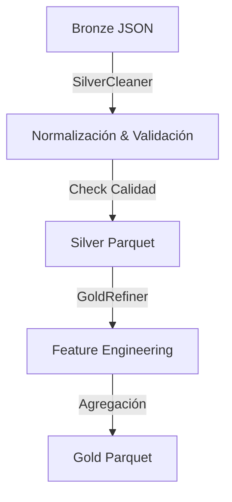

# Anexo 03: Procesos ETL y Transformaciones

## 1. Pipeline ETL General

El pipeline (`ciber_etl`) transforma los datos crudos en inteligencia accionable, ejecutándose en dos fases principales mediante contenedores Docker.

## 2. Silver ETL: Limpieza y Validación

**Script**: `data_engineering/silver_etl.py`

### Funciones Principales
1.  **Limpieza de HTML**: Eliminación de etiquetas y normalización de texto.
2.  **Estandarización de Fechas**: Conversión a ISO-8601 (UTC).
3.  **Unificación**: Consolidación de señales sociales.
4.  **Validación de Calidad**:
    *   Usa **Great Expectations** para aplicar reglas de negocio.
    *   *Regla*: `expect_column_values_to_not_be_null` en campos críticos (`title`, `url`).
    *   *Regla*: `expect_column_values_to_match_regex` para validar formatos de links.
5.  **Persistencia**: Guarda particiones Parquet optimizadas para lectura.

## 3. Gold ETL: Ingeniería de Características

**Script**: `data_engineering/gold_etl.py`

Esta etapa crea las métricas avanzadas que alimentan el dashboard.

### 3.1 Tech Edge Score (Índice de Innovación)
Combina NLP estadístico con inferencia semántica de LLM para puntuar papers.
*   **Complejidad (TF-IDF)**: Calcula qué tan "denso" es el lenguaje técnico del paper usando TF-IDF. Detecta keywords raras.
*   **Parallel Scoring (AI Edge)**: Utiliza `ThreadPoolExecutor` para paralelizar peticiones a LLMs. El sistema procesa lotes de registros simultáneamente para optimizar el rendimiento de la API.
*   **Robust Parsing**: Implementa extracción basada en **Regex** para capturar valores numéricos de las respuestas crudas de los LLMs, previniendo errores por formatos inconsistentes.
*   *Fórmula*: `Edge Score = (TF_IDF_Norm + AI_Score_Norm) / 2`

### 3.2 Vulnerability Index (Time Series)
Agrega vulnerabilidades por día para análisis temporal.
*   **Imputación**: Si faltan fechas, simula distribución histórica para demostraciones.
*   **Rolling Average**: Calcula media móvil de 7 días para suavizar picos y detectar tendencias sostenidas de riesgo.

### 3.3 Matriz de Correlación
Cruza señales sociales con volumen de vulnerabilidades.
*   **Sentiment Analysis**: Usa `TextBlob` en tweets/posts para obtener polaridad (-1 a 1).
*   **Fusión**: Une datasets por fecha (`inner join`) para encontrar días donde picos de discusión negativa coinciden con publicaciones de CVEs críticos.
