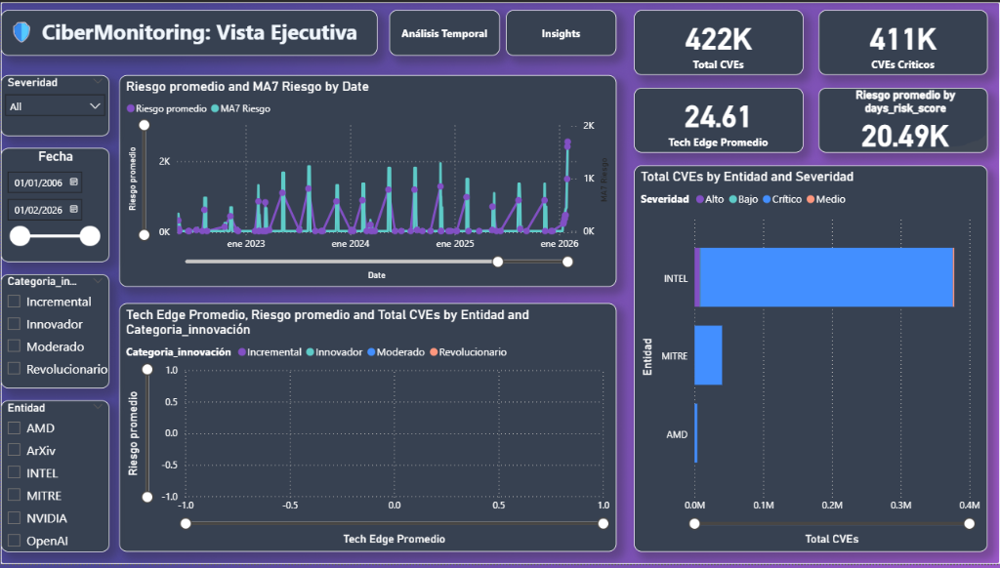
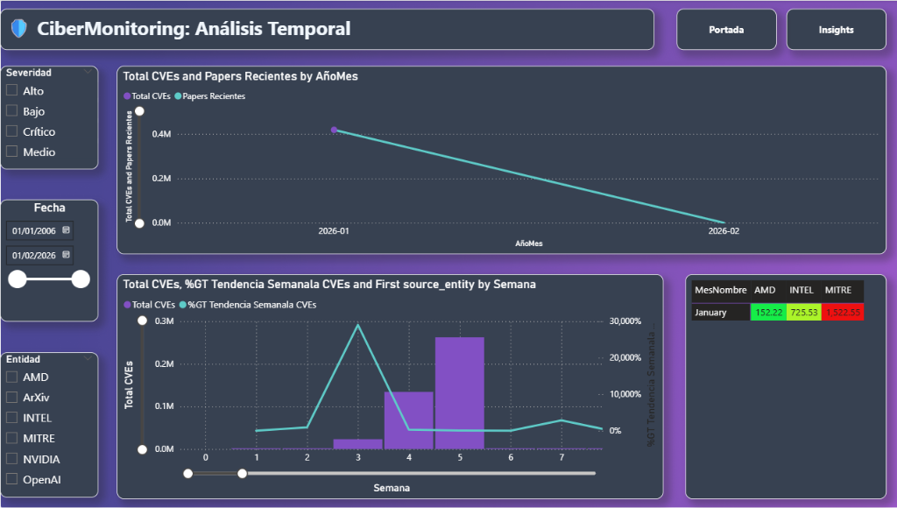
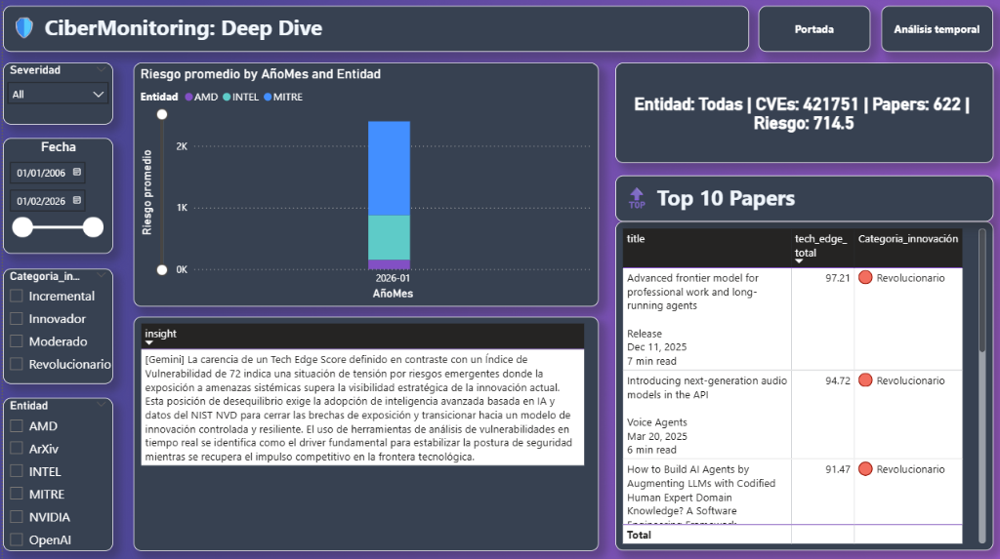

# Anexo 06: Dashboards y Visualización

## 1. Capa de Consumo

La plataforma ofrece dos interfaces principales para el consumo de inteligencia:
1.  **API REST (FastAPI)**: Para integración programática.
2.  **Dashboard (Power BI)**: Para análisis visual ejecutivo.
3.  **Chatbot (Gradio)**: Para consultas conversacionales ad-hoc.

---

## 2. API Gateway

**Container**: `ciber_api`
**Puerto**: `8000`

### Endpoints Clave
| Endpoint | Método | Descripción | Uso |
| :--- | :--- | :--- | :--- |
| `/api/v1/tech-edge-score` | GET | Recupera el ranking de papers más innovadores. | KPI de Innovación |
| `/api/v1/vulnerability-index` | GET | Serie temporal de volumen de riesgo. | Gráfico de Líneas |
| `/api/v1/correlation/matrix` | GET | Datos de correlación Social-Riesgo. | Scatter Plot |
| `/api/v1/storytelling-history` | GET | Historial de insights generados con metadatos del modelo. | Narrativa / Tabla |
| `/docs` | GET | Swagger UI interactivo. | Documentación |

---

## 3. Estrategia Power BI

Power BI consume los archivos de la Capa Gold (`.parquet`) o conecta directamente a la API vía conector Web.

### Visuales Recomendados
1.  **Innovation Radar**: Gráfico de dispersión (Scatter).
    *   Eje X: `complexity_score`
    *   Eje Y: `ai_innovation_score`
    *   Tamaño: Importancia/Relevancia
    *   *Insight*: Puntos en el cuadrante superior derecho son "Tecnología de Punta Compleja".

2.  **Risk Timeline**: Gráfico de líneas combinado.
    *   Línea 1: Volumen de CVEs.
    *   Línea 2: Sentimiento social promedio (invertido).
    *   *Insight*: Cruces indican momentos de pánico o explotación activa.

---

## 4. MVP Implementado (Power BI)

Modelo mínimo viable implementado utilizando las tablas Gold (`TechEdgeScore`, `VulnerabilityIndex`) para cruzar datos y detectar patrones visualmente.

### 4.1. Estructura del Modelo

**Tablas Principales**:
*   **TechEdgeScore**: Contiene scores de innovación y complejidad de papers (Fuente: Nvidia, OpenAI, ArXiv).
*   **VulnerabilityIndex**: Contiene métricas de riesgo y conteo de CVEs (Fuente: Mitre, Intel, AMD).
*   **Calendario**: Tabla de fechas calculada para inteligencia de tiempo.
*   **Entidades**: Tabla unificada de fabricantes y fuentes.

**Métricas Clave (KPIs)**:
*   **Vulnerabilidades**: Total CVEs, CVEs Críticos (>80 risk), Riesgo Promedio, Tendencias Semanales.
*   **Innovación**: Total Papers, Tech Edge Promedio, Papers Alto Impacto, Top Innovador.
*   **Correlación**: Índice de Alerta (Riesgo vs Innovación), Ratio CVE/Paper.

### 4.2. Dashboards Implementados

#### 📊 Página 1: Vista Ejecutiva
Visión general del estado de ciberseguridad e innovación.
*   **Visuales**: Línea de tiempo de Riesgo vs MA7, Scatter Plot de Riesgo vs Innovación, Barras de CVEs por Entidad/Severidad.
*   **Insight**: Permite identificar rápidamente qué entidades presentan mayor riesgo frente a su actividad innovadora.

#### 📈 Página 2: Análisis Temporal
Evolución histórica de las amenazas y publicaciones.
*   **Visuales**: Matriz de calor de Riesgo Mensual, Gráfico de Área de CVEs vs Papers, Tendencias semanales.
*   **Insight**: Detecta patrones estacionales o picos de actividad correlacionados.

#### 🔍 Página 3: Deep Dive por Entidad
Análisis detallado filtrado por fabricante o fuente.
*   **Visuales**: Resumen de KPIs específicos, Tabla de Top 10 Papers revolucionarios, Ranking temporal.
*   **Insight**: Profundiza en el desempeño específico de cada actor del ecosistema (ej. Nvidia vs AMD).

---

## 5. Gradio Assistant (ChatInterface)

**Container**: `ciber_chatbot`
**Puerto**: `7860`

Interfaz ligera para interactuar con el modelo **Gemma 3**.
*   **Pestaña Chat**: Interfaz conversacional con soporte de historial y formateo Markdown.
*   **Pestaña Upload**: Permite subir documentos PDF/TXT adicionales para enriquecer la base de conocimiento vectorial (RAG) en tiempo caliente.
*   **Tool Use**: El chatbot puede decidir consultar la API en tiempo real si el usuario pregunta por "el último score".
